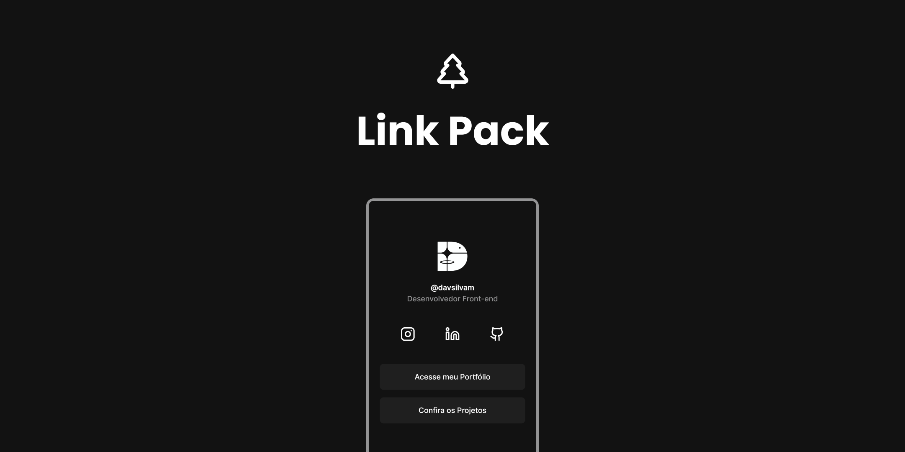
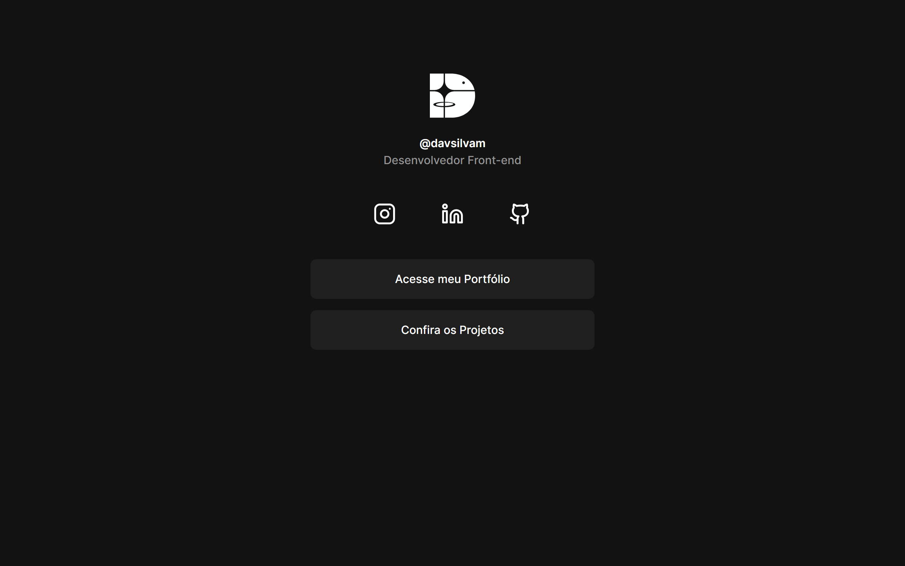
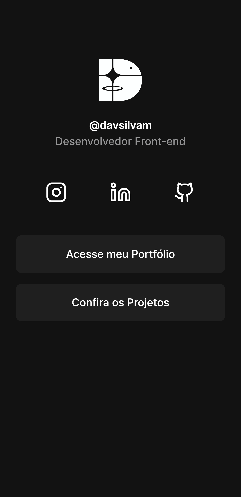

# Link Pack



## :bookmark: **Sumário**
- [Sobre o Projeto](#evergreen_tree-sobre-o-projeto)
- [Visual do Projeto](#art-visual-do-projeto)
   - [Desktop e Telas Maiores](#desktop-e-telas-maiores)
   - [Mobile e Telas Menores](#mobile-e-telas-menores)
- [S.T.A.R.T](#pencil2-start)
   - [S - Situation](#s---situation)
   - [T - Tasks](#t---tasks)
   - [A - Action](#a---action)
   - [R - Results](#r---results)
   - [T - Take Away](#t---take-away)
- [Tecnologias](#wrench-tecnologias)
   - [Construção do site](#construção-do-site)
   - [Estilização](#estilização)
   - [IDE, Versionamento e Deploy](#ide-versionamento-e-deploy)
- [Configurações e Instalação](#rocket-configurações-e-instalação)
     - [Requisitos](#requisitos)
- [Licença](#balance_scale-licença)

## :evergreen_tree: **Sobre o Projeto**

O Link Pack é um agregador de links inspirado no [Linktree](https://linktr.ee). Ele serve para facilitar o fluxo do meu instagram para minhas demais redes, além de apresentar uma página de projetos.

<p align="center">
   <a href="https://linkpack.vercel.app">Veja o projeto completo aqui.</a>
</p>

## :art: **Visual do Projeto**

### _Desktop e Telas Maiores_

<h1 align="center">
    
</h1>

### _Mobile e Telas Menores_

<h1 align="center">
    
</h1>

## :pencil2: **S.T.A.R.T**

### S - Situation

> Fiz esse projeto sozinho, visando criar uma árvore de links para minha página no Instagram.

### T - Tasks

> Meu principal objetivo era criar um lugar onde meus seguidores no Instagram pudessem visualizar os projetos mais facilmente, além de se locomover pelas minhas redes.

### A - Action

> Para isso, criei tanto rotas internas quanto externas, contanto com uma mini galeria dos projetos para o usuário explorar.

### R - Results

> Como resultado, consegui unir várias coisas em um lugar só e simplificar a interação do meu usuário com meus projetos.

### T - Take Away

> Com esse projeto consegui criar um roteamento dinâmico, que carrega repositórios selecionados do GitHub.

## :wrench: **Tecnologias**

Tecnologias utilizadas no projeto.

### **Construção do site**

- [TypeScript](https://www.typescriptlang.org)
- [Vue.js](https://vuejs.org)
- [Vite](https://vitejs.dev/)

### **Estilização**

- [Tailwind CSS](https://tailwindcss.com)
- [Lucide Icons](https://lucide.dev)
- [Google Fonts](https://fonts.google.com)

### **IDE, Versionamento e Deploy**

- [Visual Studio Code](https://code.visualstudio.com)
- [Git](https://git-scm.com)
- [GitHub](https://github.com)
- [Vercel](https://vercel.com/)

## :rocket: **Configurações e Instalação**

### Requisitos

- [Node e NPM](https://nodejs.org/)
- [Volar](https://marketplace.visualstudio.com/items?itemName=Vue.volar)

Recomendo que veja a [documentação de configuração do Vite](https://vitejs.dev/config/).

```shell
# Clonando o projeto
git clone https://github.com/davsilvam/link-pack-v2.git

# Instalando as dependências
npm install

# Compilar e abrir o programa para desenvolvimento
npm run dev

# Compilar e minificar para produção
npm run build
```

## :balance_scale: **Licença**

Esse projeto está sob a [licença MIT](https://github.com/davsilvam/link-pack-v2/blob/main/LICENSE.md).

---

Feito com 🤍 e ☕ por <a href="https://www.linkedin.com/in/davsilvam/">David Silva</a>.

> [Portfólio](https://davidsilvam.vercel.app) &nbsp;&middot;&nbsp;
> GitHub [@davsilvam](https://github.com/davsilvam) &nbsp;&middot;&nbsp;
> Instagram [@davsilvam_](https://www.instagram.com/davsilvam_/)
